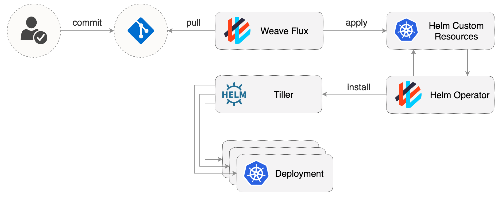

# OpenFaaS GitOps workflow with Weave Flux 

This is a step by step guide on setting up a GitOps workflow for OpenFaaS with Weave Flux. 
GitOps is a way to do Continuous Deliver, it works by using Git as a source of truth for 
declarative infrastructure and workloads. 
In practice this means using `git push` instead of `kubectl create/apply` or `helm install/upgrade`. 

### Install Weave Flux 

Add Weave Flux chart repo:

```bash
helm repo add sp https://stefanprodan.github.io/k8s-podinfo
```

Install Weave Flux and its Helm Operator by specifying your fork URL 
(replace `stefanprodan` with your GitHub username): 

```bash
helm install --name cd \
--set helmOperator.create=true \
--set git.url=git@github.com:stefanprodan/openfaas-flux \
--set git.chartsPath=charts \
--namespace flux \
sp/weave-flux
```

You can connect Weave Flux to Weave Cloud using a service token:

```bash
helm install --name cd \
--set token=YOUR_WEAVE_CLOUD_SERVICE_TOKEN \
--set helmOperator.create=true \
--set git.url=git@github.com:stefanprodan/openfaas-flux \
--set git.chartsPath=charts \
--namespace flux \
sp/weave-flux
```

### Setup Git sync

At startup Flux generates a SSH key and logs the public key. 
Find the SSH public key with:

```bash
export FLUX_POD=$(kubectl get pods --namespace flux -l "app=weave-flux,release=cd" -o jsonpath="{.items[0].metadata.name}")
kubectl -n flux logs $FLUX_POD | grep identity.pub | cut -d '"' -f2 | sed 's/.\{2\}$//'
```

In order to sync your cluster state with git you need to copy the public key and 
create a **deploy key** with **write access** on your GitHub repository.

Open GitHub, navigate to your fork, go to _Setting > Deploy keys_ click on _Add deploy key_, check 
_Allow write access_, paste the Flux public key and click _Add key_.

After a couple of seconds Flux
* creates the `openfaas` and `openfaas-fn` namespaces
* installs OpenFaaS Helm release
* creates the OpenFaaS functions

Check OpenFaaS services deployment status:

```
kubectl -n openfaas get deployments
NAME           DESIRED   CURRENT   UP-TO-DATE   AVAILABLE   AGE
alertmanager   1         1         1            1           1m
gateway        1         1         1            1           1m
nats           1         1         1            1           1m
prometheus     1         1         1            1           1m
queue-worker   1         1         1            1           1m
```

You can access the OpenFaaS Gateway using the NodePort service:

```
kubectl -n openfaas get svc gateway-external
NAME               TYPE       CLUSTER-IP      EXTERNAL-IP   PORT(S)          AGE
gateway-external   NodePort   10.27.247.217   <none>        8080:31112/TCP   10h
```


### Manage Helm releases with Weave Flux

The Flux Helm operator provides an extension to Weave Flux to be able to automate Helm Chart releases.
A Chart release is described through a Kubernetes custom resource named `FluxHelmRelease`.
The Flux daemon synchronises these resources from git to the cluster,
and the Flux Helm operator makes sure Helm charts are released as specified in the resources.



OpenFaaS release definition:

```yaml
apiVersion: helm.integrations.flux.weave.works/v1alpha2
kind: FluxHelmRelease
metadata:
  name: openfaas
  namespace: openfaas
  labels:
    chart: openfaas
spec:
  chartGitPath: openfaas
  releaseName: openfaas
  values:
    serviceType: NodePort
    rbac: true
    images:
      gateway: functions/gateway:0.8.0
      prometheus: prom/prometheus:v2.2.0
      alertmanager: prom/alertmanager:v0.15.0-rc.1
      nats: nats-streaming:0.6.0
      queueWorker: functions/queue-worker:0.4.3
      operator: functions/faas-o6s:0.4.0
```

You can use kubectl to list Flux Helm releases:

```
kubectl -n openfaas get FluxHelmReleases
NAME       AGE
openfaas   1m
```

### Manage OpenFaaS functions with Weave Flux

An OpenFaaS function is describe through a Kubernetes custom resource named `function`.
The Flux daemon synchronises these resources from git to the cluster,
and the OpenFaaS Operator creates for each function a Kubernetes deployment and a ClusterIP service as specified in the resources.


OpenFaaS function definition:

```yaml
apiVersion: o6s.io/v1alpha1
kind: Function
metadata:
  name: certinfo
  namespace: openfaas-fn
spec:
  name: certinfo
  replicas: 1
  image: stefanprodan/certinfo
  limits:
    cpu: "100m"
    memory: "128Mi"
  requests:
    cpu: "10m"
    memory: "64Mi"
```

You can use kubectl to list OpenFaaS functions:

```
kubectl -n openfaas-fn get functions
NAME       AGE
certinfo   1m
nodeinfo   1m
```

### Manage Network Policies with Weave Flux

If you use a CNI like Weave Net or Calico that supports network policies you can enforce traffic rules for OpenFaaS 
by placing `NetworkPolicy` definitions inside the `network-policies` dir. 
The Flux daemon will apply the policies on your cluster along with the namespaces labels.


Deny ingress access to functions except from namespaces with `role: openfaas-system` label:

```yaml
apiVersion: networking.k8s.io/v1
kind: NetworkPolicy
metadata:
  name: openfaas-fn
  namespace: openfaas-fn
spec:
  policyTypes:
  - Ingress
  podSelector: {}
  ingress:
  - from:
    - namespaceSelector:
        matchLabels:
          role: openfaas-system
```

Allow OpenFaaS core services to reach the `openfaas-fn` namespace by applying the `role: openfaas-system` label:

```yaml
apiVersion: v1
kind: Namespace
metadata:
  name: openfaas
  labels:
    role: openfaas-system
    access: openfaas-system
```

Deny ingress access to OpenFaaS core services except from namespaces with `access: openfaas-system` label:

```yaml
kind: NetworkPolicy
apiVersion: networking.k8s.io/v1
metadata:
  name: openfaas
  namespace: openfaas
spec:
  policyTypes:
  - Ingress
  podSelector: {}
  ingress:
  - from:
    - namespaceSelector:
        matchLabels:
          access: openfaas-system
```

Allow Weave Cloud to scrape the OpenFaaS Gateway by applying the `access: openfaas-system` label to `weave` namespace:

```yaml
apiVersion: v1
kind: Namespace
metadata:
  name: weave
  labels:
    access: openfaas-system
```

